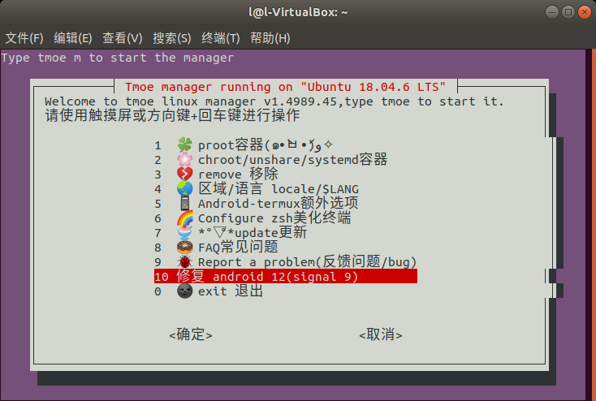

安卓12注意事项

> 尚未完工

见[Termux issues #2366](https://github.com/termux/termux-app/issues/2366)

对于使用安卓12的Termux用户，可能遇到如下问题，这会导致Termux直接退出
```
[Process completed (signal 9) - press Enter]
```
 这是因为Android 12 上，Google 引入了一个 "phantom process killer" 的机制，这个机制会定期清理后台进程  
我不确定Exagear会不会因为这个问题而闪退或被杀后台，如果是被杀后台，请先参考[Don’t kill my app!](https://dontkillmyapp.com/)
，如果问题仍未解决，请根据如下步骤操作：

> 以下步骤参考此文章：[Android Phantom, Cached And Empty Processes](https://gist.github.com/agnostic-apollo/dc7e47991c512755ff26bd2d31e72ca8#disable-phantom-process-killing)  

- 如果你有电脑或是一个能帮别的设备进行adb调试的设备：  
  在adb连接成功后执行以下命令(每次重启后需重新执行)：
```
adb shell "/system/bin/device_config put activity_manager max_phantom_processes 2147483647"
```
如果要一劳永逸(有风险)：
```
adb shell "/system/bin/device_config set_sync_disabled_for_tests persistent; /system/bin/device_config put activity_manager max_phantom_processes 2147483647"
```
其余情况请先安装[Termux](https://mirrors.tuna.tsinghua.edu.cn/fdroid/repo/com.termux_118.apk)  

- 如果你没有root权限并且没有电脑：
1. 进入Termux后，执行如下命令安装[TMOE](https://gitee.com/mo2/linux)
```
curl -LO l.tmoe.me/tinor.deb
apt install ./tinor.deb
apt update
```
2. 进入TMOE后，选择"修复 android 12(signal 9)"
3. 根据提示操作即可(尚未完工)

- 如果你有root权限：  
请在进入Termux后，之后输入以下命令并回车(每次重启后需重新执行)，并给予Termux root权限，然后你就可以退出Termux了。  
(一般情况下，**不要**随便让一个未知的软件获得root权限！但Termux是可以信任的，它是开源的，[Termux · GitHub](https://github.com/termux))
```
su -c "/system/bin/device_config put activity_manager max_phantom_processes 2147483647"
```
如果要一劳永逸(有风险)：
```
su -c "/system/bin/device_config put activity_manager max_phantom_processes 2147483647"
```