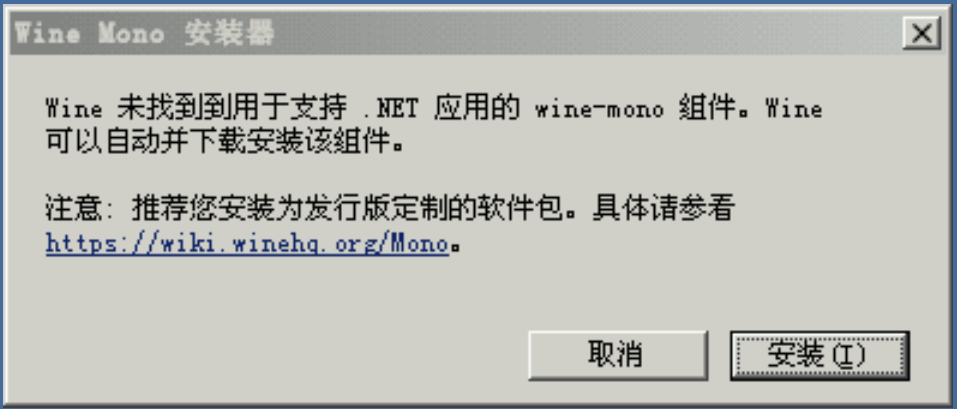

# 安装指南

::: warning 尚未完工
:::

## Exagear 安装

前往[下载](/down)页面下载Exagear并安装，之后运行Exagear，给予存储权限  
非直装版请先解压数据包，再运行Exagear

- 对于ED301，请将`main.31.com.antutu.ABenchMark.obb`和`bass.so`  
放在`/sdcard/`或`/storage/emulated/0/`下
- 对于Exagear 4合1版，请将`main.30.com.ludashi.benchmark.obb`  
放在`/storage/emulated/0/Android/obb/com.ludashi.benchmark/`下

进入Exagear后，点击左上角的三条横杠，之后点击"环境管理"  
然后点击右上角的加号，创建环境

::: warning
如果你使用的是**VirGL版、Turnip Zink版或4合1版**Exagear，请按照下面的步骤操作，否则你将无法正常启动游戏
::: details 点击展开
创建环境后，点击该环境最右端的三个点，然后点击"设置"或"Settings"

如果是**高通骁龙**处理器的设备：
- 非4合1版：调整"图形渲染器"选项至"VirtIO-GPU"
- 4合1版fix35：调整"GPU"选项至以"VirtIO"开头的那个
- 4合1版fix38及以后：调整"GPU"选项至"Hardware"

如果是**华为/荣耀**设备：
- 非4合1版：调整"图形渲染器"选项至"LLVM 10"
- 4合1版fix35：调整"GPU"选项至以"llvmpipe"开头的那个
- 4合1版fix38及以后：调整"GPU"选项至"Software"  

之后点击左上角的箭头返回
:::

点击该环境最右端的三个点，并点击"启动"或"Start"  
第一次启动环境时，一般会弹出如图的窗口，此时点击"取消"即可  

8. 在文件管理器中打开D盘(对应设备上的`/storage/emulated/0/Exagear`，部分版本是`/storage/emulated/0/Download`)，打开游戏即可

## InputBridge 安装